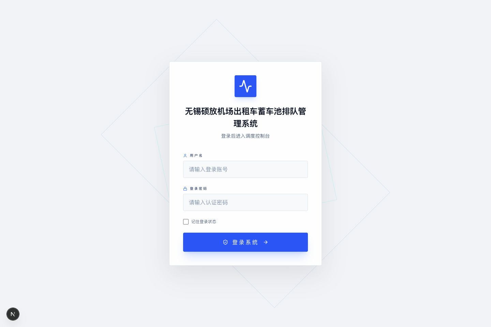
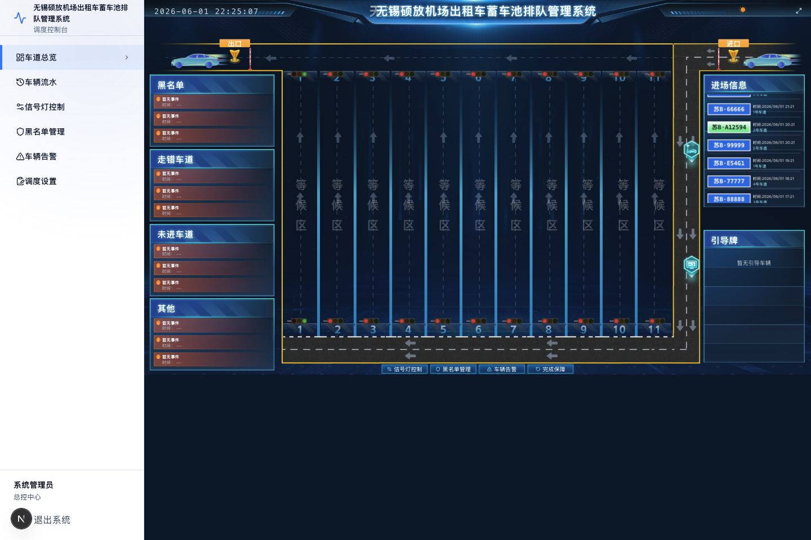
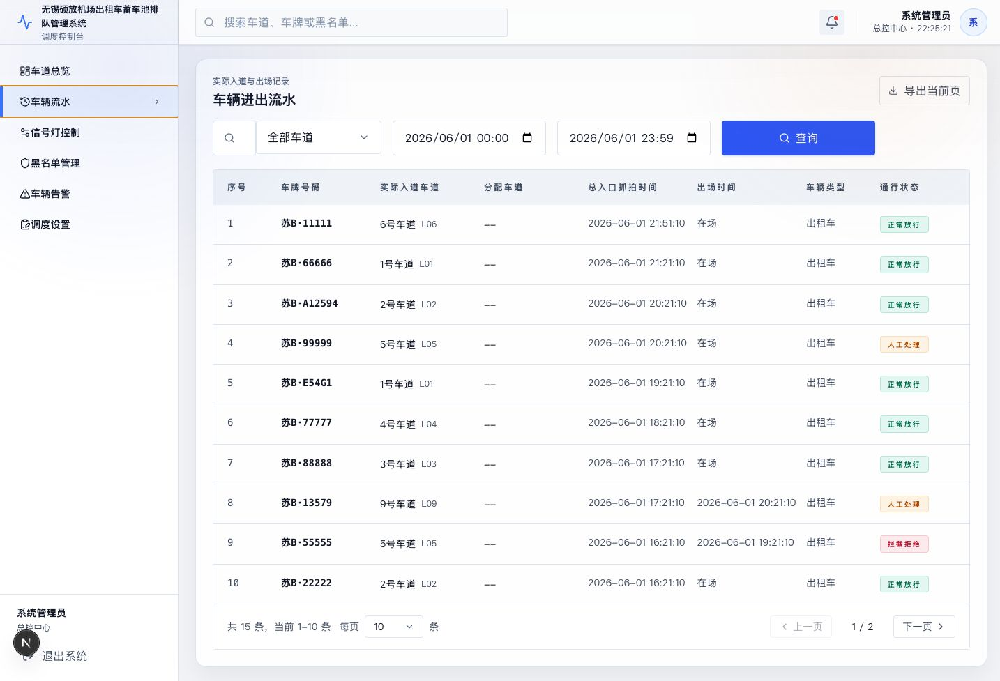
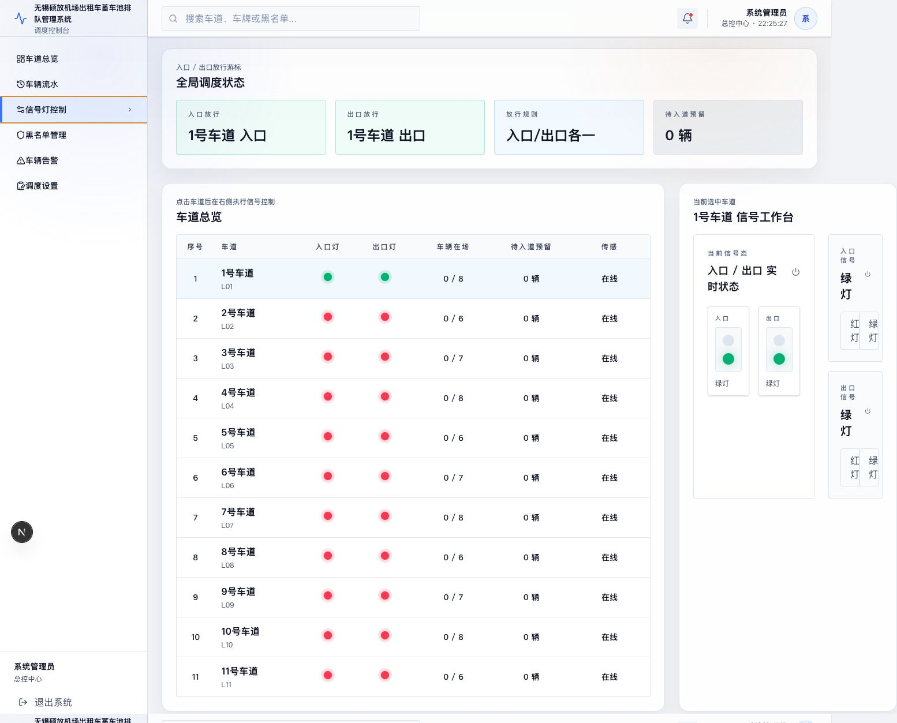
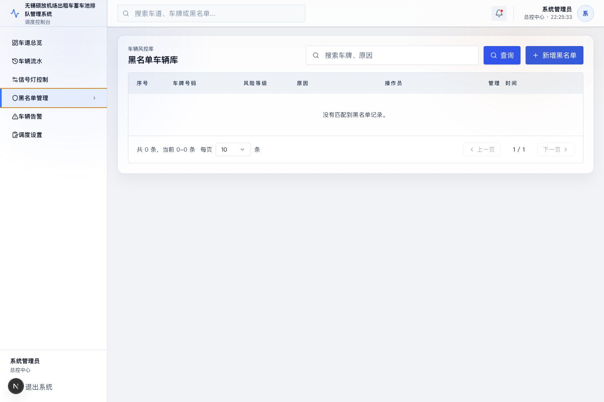
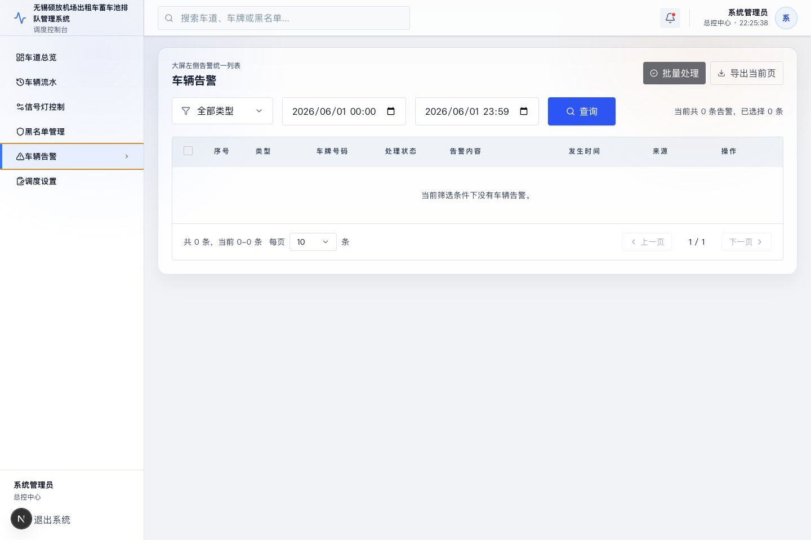
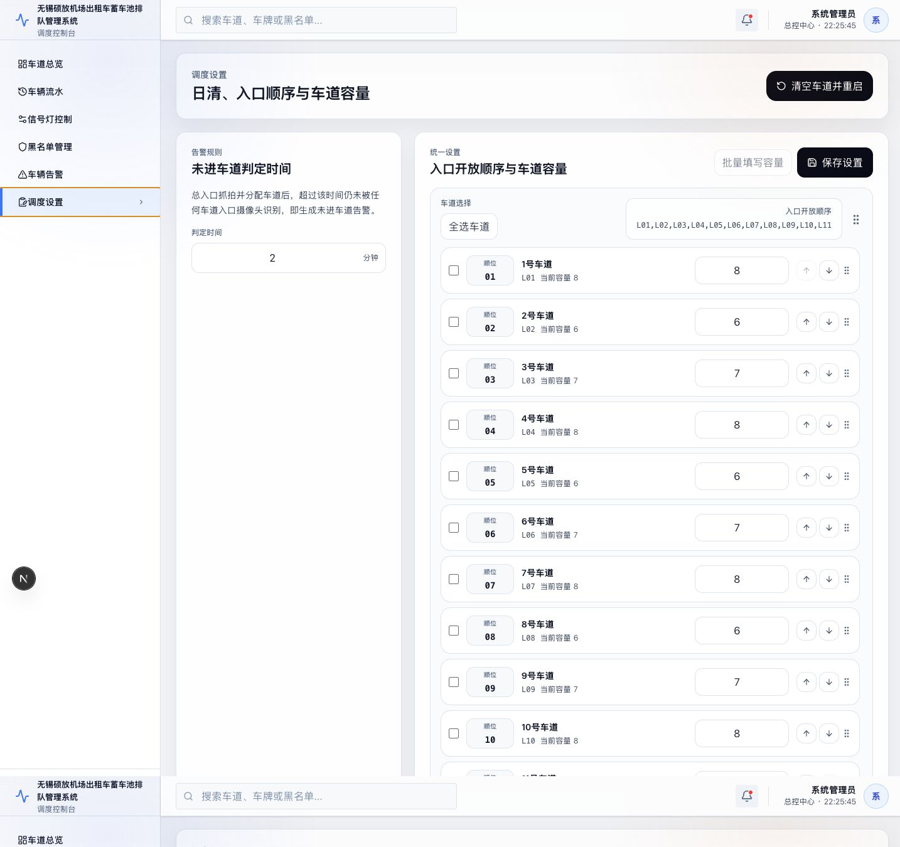
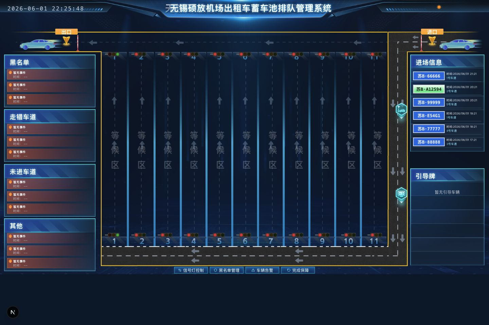
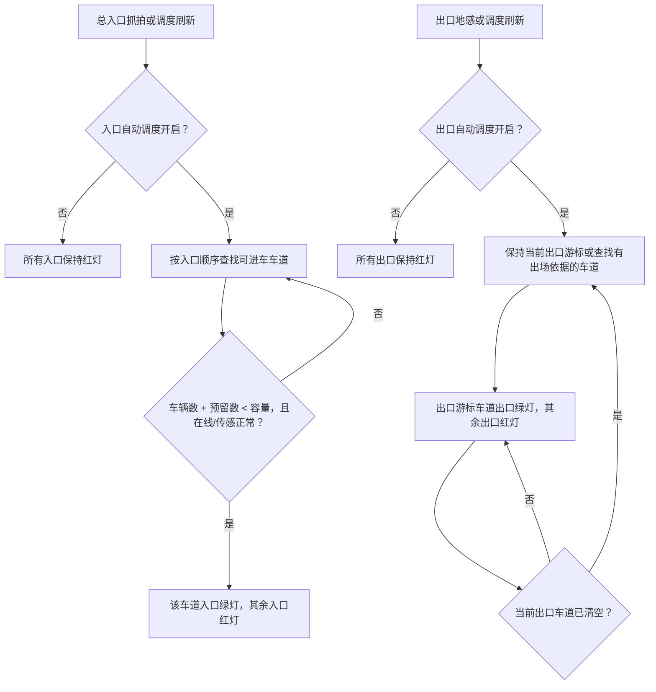

# 无锡硕放机场出租车蓄车池排队管理系统操作文档

> 本文用于现场调度人员、值班管理员和运维人员日常操作。截图基于本地演示环境生成，业务数据会随现场实际运行变化。

## 1. 登录与退出

访问系统地址后进入登录页。开发环境通常为 `http://localhost:3000`，Docker/Nginx 统一入口通常为 `http://localhost:3002`。默认管理员账号见项目 `README.md`，生产现场首次上线后应替换默认账号或密码。

操作步骤：

1. 输入用户名和密码。
2. 如需保留本机登录状态，可勾选“记住登录状态”。
3. 点击“登录系统”进入调度控制台。
4. 退出时点击左侧菜单底部“退出系统”。

## 2. 菜单功能总览

系统左侧菜单包含 6 个主要功能：

| 菜单 | 主要用途 | 常用操作 |
| --- | --- | --- |
| 车道总览 | 查看大屏总览、告警、进场信息、引导牌、车道态势 | 查看车道状态，跳转信号灯、黑名单、车辆告警，执行完成保障 |
| 车辆流水 | 查询实际入道和出场记录 | 按车牌、车道、时间筛选，导出当前页 |
| 信号灯控制 | 查看和人工切换入口/出口红绿灯 | 选择车道，切换入口信号或出口信号 |
| 黑名单管理 | 维护内部黑名单车辆 | 新增、编辑、删除、查询黑名单 |
| 车辆告警 | 统一处理大屏告警 | 按类型/时间筛选，单条或批量处理，导出当前页 |
| 调度设置 | 配置入口开放顺序、车道容量、未进车道判定时间 | 调整顺序，修改容量，批量填写容量，保存设置，清空车道并重启 |

权限说明：

- `ADMIN`：可使用全部菜单和操作。
- `DISPATCHER`：可操作信号灯控制和调度设置。
- 其他已登录用户：以查看类功能为主，黑名单和调度类操作会受限。

## 3. 车道总览

车道总览是调度控制台首页，显示 1 至 11 号车道的等待区、入口/出口方向、红绿灯状态、左侧告警、右侧进场信息和引导牌信息。

页面重点：

- 左侧告警区：按黑名单、走错车道、未进车道、其他分类展示待处理事件。
- 中间车道区：显示各车道等待区、入口端和出口端灯态。
- 右侧进场信息：显示最近进入蓄车池或车道的车辆。
- 右侧引导牌：显示当前总入口推荐车道信息。
- 底部快捷操作：可进入“信号灯控制”“黑名单管理”“车辆告警”，也可执行“完成保障”。
- 右上角放大按钮：用于把总览界面放大为更接近现场大屏的显示模式。

“完成保障”用于班次结束或每日保障完成后清空当前周期：系统会关闭未出场流水和未关闭引导记录，清空车道在场数，恢复自动调度，并重新打开入口/出口首条车道。

## 4. 车辆流水

车辆流水用于查询实际入道与出场记录。

功能说明：

- 车牌搜索：支持按车牌号模糊查询。
- 车道筛选：可查看全部车道或指定车道。
- 时间筛选：默认查询当天，可调整开始和结束时间。
- 导出当前页：导出当前筛选条件下当前页记录为 CSV。
- 分页：可切换页码和每页条数。

字段说明：

- 实际入道车道：车辆被车道入口摄像头识别后的实际车道。
- 分配车道：总入口抓拍后系统推荐的车道。
- 总入口抓拍时间：车辆进入蓄车池或被总入口识别的时间。
- 出场时间：为空时页面显示“在场”。
- 通行状态：包含正常放行、人工处理、拦截拒绝等状态。

## 5. 信号灯控制

信号灯控制页用于查看当前入口/出口放行游标，并对单条车道执行人工切换。

页面结构：

- 全局调度状态：显示当前入口放行车道、出口放行车道、放行规则和待入道预留数量。
- 车道总览表：显示每条车道入口灯、出口灯、在场车辆数、预留车辆数和传感状态。
- 信号工作台：点击某条车道后，右侧显示该车道入口/出口实时信号和切换按钮。

操作步骤：

1. 在“车道总览”表中点击目标车道。
2. 在右侧“入口信号”或“出口信号”区域选择“红灯”或“绿灯”。
3. 弹窗确认后，系统下发切换指令。
4. 入口与出口互不抢占，切入口灯只影响入口放行游标，切出口灯只影响出口放行游标。

注意事项：

- 同一车道允许入口灯和出口灯同时为绿灯，表示入口游标和出口游标都指向该车道。
- 人工切绿灯会把对应方向的放行游标切到当前车道。
- 人工把当前放行车道切红灯时，系统会按自动规则寻找下一条可用车道。
- 车道传感异常、离线或容量不可用时，自动入口调度会跳过该车道。

## 6. 黑名单管理

黑名单管理用于维护内部风险车辆库。

功能说明：

- 查询：按车牌或原因搜索。
- 新增黑名单：填写车牌号码、封禁原因和风险等级。
- 编辑：修改车牌、原因或风险等级。
- 删除：从黑名单库移除车辆。

黑名单命中逻辑：当总入口或车道识别到黑名单车辆时，系统会在大屏和“车辆告警”菜单中生成黑名单告警，提醒现场人员处理。

## 7. 车辆告警

车辆告警页汇总大屏左侧所有告警，并支持集中处理。

告警类型：

- 黑名单：识别到内部黑名单车辆。
- 走错车道：车辆实际进入车道与总入口推荐车道不一致。
- 未进车道：总入口已抓拍并分配车道，但超过判定时间仍未被任何车道入口摄像头识别。
- 其他：设备异常等其他事件。

常用操作：

1. 通过“全部类型”和时间范围筛选告警。
2. 勾选未处理告警后点击“批量处理”。
3. 单条告警可点击行末“处理”。
4. 点击“导出当前页”导出当前筛选结果。

处理告警后，该事件会从大屏待处理弹窗或待处理列表中移除。

## 8. 调度设置

调度设置用于维护入口自动开放顺序、车道容量和未进车道判定时间。

功能说明：

- 未进车道判定时间：总入口抓拍并分配车道后，超过该分钟数仍未被任何车道入口摄像头识别，会生成“未进车道”告警。默认值为 2 分钟。
- 入口开放顺序：系统按该顺序寻找下一条可开放入口的车道，支持拖拽、上移、下移。
- 车道容量：用于判断车道是否还能继续入口放行。车辆数加预留数达到容量时，入口灯会转红并切到下一车道。
- 批量填写容量：勾选多条车道后一次性填写相同容量。
- 保存设置：保存入口顺序、未进车道判定时间和已修改的车道容量。
- 清空车道并重启：执行日清，清空当前周期数据并重新开启自动调度。

建议：入口顺序和容量属于现场调度基础参数，修改前应确认现场车道组织和实际可停车辆数。

## 9. 大屏独立展示页

`/screen` 是独立大屏展示页，适合接入现场显示屏或大屏浏览器。它不依赖左侧控制台菜单，主要用于展示车道状态、车辆进场信息、告警和引导牌。

## 10. 出入口红绿灯切换逻辑

### 10.1 核心概念

系统把入口和出口分成两个独立的放行游标：

- 入口放行游标：当前允许车辆进入的车道，对应 `active_entry_lane`。
- 出口放行游标：当前允许车辆驶出的车道，对应 `active_exit_lane`。

因此系统规则是“入口最多一条绿灯，出口最多一条绿灯”。入口和出口互不抢占，所以同一车道可以同时出现入口绿灯和出口绿灯。

车道最终灯态由以下规则渲染：

- 车道离线：入口灯和出口灯均显示离线/关闭。
- 车道是当前入口放行车道，且还有可用名额：入口绿灯。
- 车道是当前出口放行车道：出口绿灯。
- 不满足以上条件：对应方向红灯。

### 10.2 入口绿灯选择规则

入口自动调度开启时，系统按“调度设置”中的入口开放顺序查找可进车车道。

车道必须同时满足以下条件，入口才可保持或切为绿灯：

1. 车道未离线。
2. 车道容量大于 0。
3. 传感状态不是 `DEGRADED`。
4. 当前车辆数 + 待入道预留数 < 车道容量。

当当前入口车道不满足条件时，系统会从当前车道的下一顺位开始查找，按顺序循环寻找下一条满足条件的车道。如果所有车道都不满足条件，则入口无绿灯。

常见触发场景：

- 总入口抓拍新车后，系统把车辆预分配到当前入口车道，待入道预留数加 1。
- 如果预分配后“车辆数 + 预留数”达到容量，当前入口车道转红，入口游标切到下一条可用车道。
- 如果当前入口车道传感异常或离线，入口游标切到下一条可用车道。
- 如果总入口抓拍来源触发时入口调度尚未开启，系统会自动开启入口调度，并选择入口顺序中的首条可用车道。

### 10.3 入口相邻车道交接

现场可能出现车辆已经实际进入下一条车道，但系统入口游标尚停留在上一条车道的情况。为避免游标滞后，系统设置了入口相邻车道交接规则：

- 当前入口放行车道为 A。
- 按入口顺序，A 的下一条车道为 B。
- 如果车道入口摄像头连续识别到 2 辆不同车辆实际进入 B，系统认为入口已经交接到 B。
- 此时入口放行游标切到 B，B 入口灯变绿，A 入口灯转红。

只有“当前车道的下一条相邻车道”会触发该交接逻辑，其他车道的入场不会直接改变入口游标。

### 10.4 出口绿灯选择规则

出口自动调度开启时，系统维护独立的出口放行游标。出口游标通常选择下一条有出场依据的车道。

“有出场依据”包括以下任一情况：

1. 车道当前车辆数大于 0。
2. 该车道存在未出场的车辆流水。
3. 该车道存在未关闭的实际入道引导记录。

出口游标切换规则：

- 当前出口车道仍可用时，系统会保持当前出口游标。
- 当前出口车道车辆全部出场，且没有未出场流水或未关闭引导记录时，系统按入口开放顺序寻找下一条有出场依据的车道。
- 如果没有任何车道有出场依据，则出口无可自动切换目标。
- 日清或完成保障后，系统会重新打开首条车道的入口和出口，方便下一班次从首车道开始。

### 10.5 出口地感和出口交接

出口地感触发时，系统会优先处理当前出口放行车道：

1. 如果该车道有未关闭的引导记录，关闭最前一条记录。
2. 否则如果该车道有未出场流水，关闭最早一条流水。
3. 否则按计数扣减 1 辆车。
4. 扣减后如果当前车道没有出场依据，出口游标切到下一条有出场依据的车道。

如果非当前出口车道触发地感，系统仍会处理该车道的出场扣减，但不会随意切换出口游标。只有当前出口车道的下一条相邻可用车道连续触发 3 次出口地感，系统才认为出口已完成交接：

- 关闭原出口车道剩余未出场记录。
- 清空原出口车道在场状态。
- 将出口放行游标切到相邻车道。

### 10.6 人工切灯与自动规则的关系

在“信号灯控制”页面执行人工切灯时：

- 将某车道入口切为绿灯：入口放行游标立即指向该车道。
- 将当前入口放行车道切为红灯：系统按入口顺序寻找下一条可进车车道。
- 将某车道出口切为绿灯：出口放行游标立即指向该车道。
- 将当前出口放行车道切为红灯：系统按出口规则寻找下一条可出场车道。

人工切灯本质上是修改对应方向的放行游标。后续车辆入场、预分配、出口地感、清空车道、日清等事件发生后，系统仍会继续按自动规则维护游标。

### 10.7 简化流程图

## 11. 常见操作流程

### 11.1 调整某条车道容量

1. 进入“调度设置”。
2. 找到目标车道，在容量输入框中填写新容量。
3. 点击“保存设置”。
4. 返回“信号灯控制”查看车辆在场数、待入道预留数和灯态是否符合预期。

### 11.2 人工切换某条车道入口绿灯

1. 进入“信号灯控制”。
2. 点击目标车道。
3. 在右侧“入口信号”区域点击“绿灯”。
4. 确认下发。
5. 查看顶部“入口放行”是否变为目标车道。

### 11.3 处理未进车道告警

1. 进入“车辆告警”。
2. 类型筛选选择“未进车道”。
3. 核对车牌、时间和来源。
4. 现场确认后点击“处理”或勾选后“批量处理”。

### 11.4 完成保障或班次日清

1. 在“车道总览”点击“完成保障”，或进入“调度设置”点击“清空车道并重启”。
2. 等待操作完成提示。
3. 系统会清空当前周期在场数据，重新启用入口/出口自动调度。
4. 进入“信号灯控制”确认入口放行和出口放行已回到首条车道。

